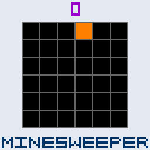
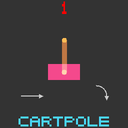
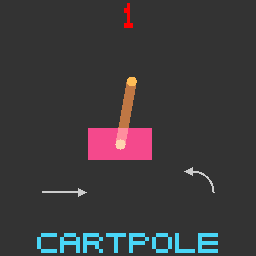
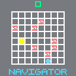
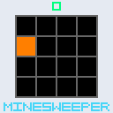
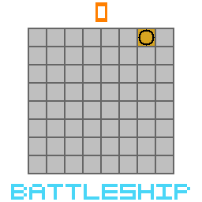
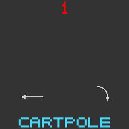
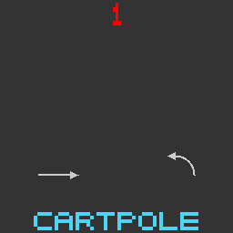
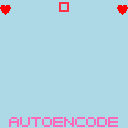
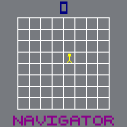

# POPGym Arcade - GPU-Accelerated POMDPs 

<p float="left">
     
     
     
     
     
     
     
</p>

<p float="left">
     
     
     
     
     
     
     
</p>

POPGym Arcade contains 7 pixel-based POMDPs in the style of the [Arcade Learning Environment](https://github.com/Farama-Foundation/Arcade-Learning-Environment). Each environment provides:
- 3 Difficulty settings
- Common observation and action space shared across all envs
- Fully observable and partially observable configurations
- Fast and easy GPU vectorization using `jax.vmap` and `jax.jit`

## Getting Started


### Installation 

To install the environments, run

```bash
pip install git+https://www.github.com/bolt-research/popgym_arcade
```

If you plan to use our training scripts, install the baselines as well

```bash
pip install popgym_arcade[baselines] @ git+https://www.github.com/bolt-research/popgym_arcade.git
```

### Creating and Stepping Environments

```python
import popgym_arcade
import jax

# Create both POMDP and MDP env variants
pomdp, pomdp_params = popgym_arcade.make("BattleShipEasy", partial_obs=True)
mdp, mdp_params = popgym_arcade.make("BattleShipEasy", partial_obs=False)

# Let's vectorize and compile the envs
# Note when you are training a policy, it is better to compile your policy_update rather than the env_step
pomdp_reset = jax.jit(jax.vmap(pomdp.reset, in_axes=(0, None)))
pomdp_step = jax.jit(jax.vmap(pomdp.step, in_axes=(0, 0, 0, None)))
mdp_reset = jax.jit(jax.vmap(mdp.reset, in_axes=(0, None)))
mdp_step = jax.jit(jax.vmap(mdp.step, in_axes=(0, 0, 0, None)))
    
# Initialize four vectorized environments
n_envs = 4
# Initialize PRNG keys
key = jax.random.key(0)
reset_keys = jax.random.split(key, n_envs)
    
# Reset environments
observation, env_state = pomdp_reset(reset_keys, pomdp_params)

# Step the POMDPs
for t in range(10):
    # Propagate some randomness
    action_key, step_key = jax.random.split(jax.random.key(t))
    action_keys = jax.random.split(action_key, n_envs)
    step_keys = jax.random.split(step_key, n_envs)
    # Pick actions at random
    actions = jax.vmap(pomdp.action_space(pomdp_params).sample)(action_keys)
    # Step the env to the next state
    # No need to reset, gymnax automatically resets when done
    observation, env_state, reward, done, info = pomdp_step(step_keys, env_state, actions, pomdp_params)

# POMDP and MDP variants share states
# We can plug the POMDP states into the MDP and continue playing 
action_keys = jax.random.split(jax.random.key(t + 1), n_envs)
step_keys = jax.random.split(jax.random.key(t + 2), n_envs)
markov_state, env_state, reward, done, info = mdp_step(step_keys, env_state, actions, mdp_params)
```

## Human Play
To best understand the environments, you should try and play them yourself. You can easily integrate with `popgym-arcade` with `pygame`.

First, you'll need to install `pygame`

```bash
pip install pygame
```

Try the [play script](play.py) to play the games yourself! All games accept arrow key input and spacebar.

```bash
python play.py
```

## Other Useful Libraries
- [`gymnax`](https://github.com/RobertTLange/gymnax) - The `jax`-capable `gymnasium` API we built upon
- [`popgym`](https://github.com/proroklab/popgym) - The original collection of POMDPs, implemented in `numpy`
- [`popjaxrl`](https://github.com/luchris429/popjaxrl) - A `jax` version of `popgym`
- [`popjym`](https://github.com/EdanToledo/popjym) - A more readable version of `popjaxrl` environments that served as a basis for our work

## Citation
Forthcoming
