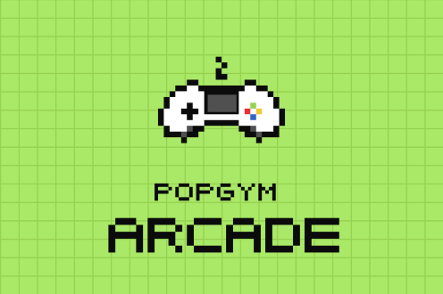
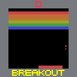
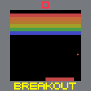
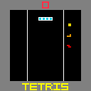
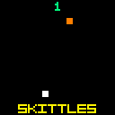
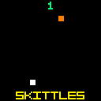

<p align="middle">
  
</p>
<p align="center">
  <a href="https://github.com/bolt-research/popgym-arcade/actions/workflows/run-tests.yaml"></a>
  <a href="https://arxiv.org/abs/2503.01450"></a>
  <a href="https://pypi.org/project/popgym-arcade/"></a>
  <a href="https://www.python.org/downloads/"></a>
  <a href="https://github.com/bolt-research/popgym-arcade/blob/main/LICENSE"></a>
  <a href="https://huggingface.co/datasets/bolt-lab/POPGym-Arcade"></a>
</p>

# POPGym Arcade

POPGym Arcade is a GPU-accelerated Atari-style benchmark and suite of analysis tools for reinforcement learning.

For more details, check out the project [website](https://bolt-research.github.io/popgym-arcade/).

Check the [documentation](docs/README.md) for the guide you need — quick start, memory introspection, or reproducing experiments.

## Tasks
POPGym Arcade contains pixel-based tasks in the style of the [Arcade Learning Environment](https://github.com/Farama-Foundation/Arcade-Learning-Environment).
<!-- 
<div style="display: flex; flex-wrap: wrap; gap: 10px; justify-content: space-between; padding: 10px;">
    
    
    
    
    
    
    
    
    
    
    
    
    
    
    
    
    
    
    
    
</div> -->
Each environment provides:
- Three difficulty settings
- One observation and action space shared across all envs
- Fully observable and partially observable configurations
- Fast and easy GPU vectorization using `jax`
- Standardized returns in `[0,1]` or `[-1, 1]`


## Baselines
We provide a [single training script](popgym_arcade/train.py) for all algorithms and memory models. The [`memax`](https://github.com/smorad/memax) library provides 18 different memory models for use in our script.

**RL Algorithms**
- [PQN](https://arxiv.org/abs/2407.04811) 
- [PPO](https://arxiv.org/abs/1707.06347)
- [DQN](https://arxiv.org/abs/1312.5602)

## Getting Started

To install the environments, run

```bash
pip install popgym-arcade
```
If you plan to use our training scripts, install the baselines as well. If you want to play the games yourself, also use the `human` flag.

```bash
pip install 'popgym-arcade[baselines,human]'
```

> [!NOTE]
> If you do not already have `jax` installed, we install CPU `jax` by default. For GPU acceleration, run `pip install jax[cuda12]` after installing `popgym-arcade`.

### Human Play
The [play script](popgym_arcade/play.py) installed with `pip install popgym-arcade[human]` lets you play the games yourself using the arrow keys and spacebar.

```bash
popgym-arcade-play NoisyCartPoleEasy        # play MDP 256 pixel version
popgym-arcade-play BattleShipEasy -p -o 128 # play POMDP 128 pixel version
```


## Other Useful Libraries
- [`stable-gymnax`](https://github.com/smorad/stable-gymnax) - A (stable) `jax`-capable `gymnasium` API
- [`memax`](https://github.com/smorad/memax) - Recurrent models for `jax` 
- [`popgym`](https://github.com/proroklab/popgym) - The original collection of POMDPs, implemented in `numpy`
- [`popjaxrl`](https://github.com/luchris429/popjaxrl) - A `jax` version of `popgym`
- [`popjym`](https://github.com/EdanToledo/popjym) - A more readable version of `popjaxrl` environments that served as a basis for our work

## Citation
If you use POPGym Arcade in your work, please cite it as follows:
```bibtex
@article{wang2025investigating,
  title={Investigating Memory in Model-Free RL with POPGym Arcade},
  author={Wang, Zekang and He, Zhe and Zhang, Borong and Toledo, Edan and Morad, Steven},
  journal={arXiv preprint arXiv:2503.01450},
  year={2025}
}
```
