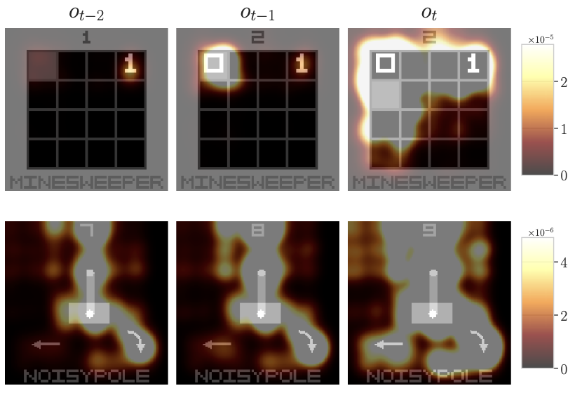
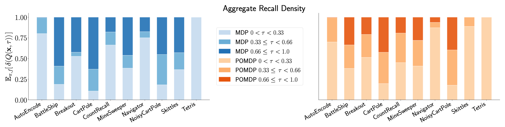
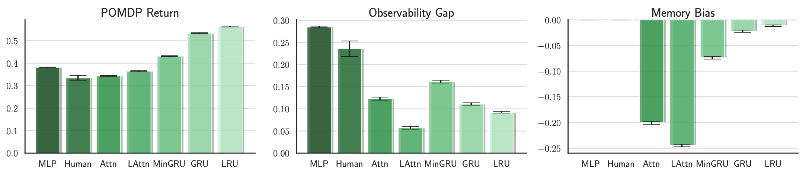
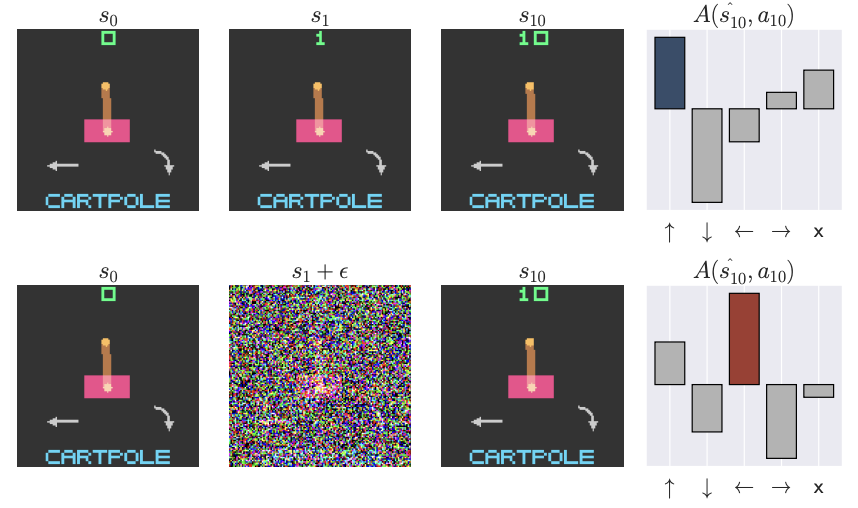
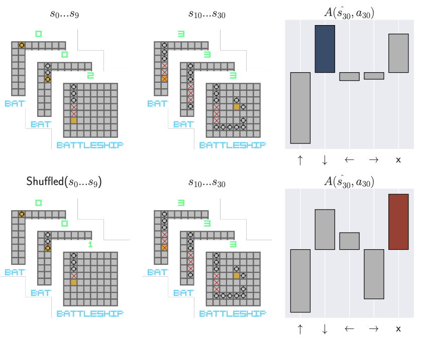

# POPGym Arcade - GPU-Accelerated POMDPs 

<div style="display: flex; gap: 20px; justify-content: center;">

  <div style="flex: 1; border: 2px solid #b2b2b2; border-radius: 10px; padding: 10px; background-color: #f9f9f9;">
    <h3 style="
    text-align: center;
    background-color: #404040;
    color: white;
    border-radius: 6px 6px 0 0;
    padding: 6px;
    margin: -10px -10px 10px -10px;
    ">
    MDP Environments
    </h3>
    <div style="display: flex; flex-wrap: wrap; gap: 10px; justify-content: center;">
      
      
      
      
      
      
      
      
      
      
    </div>
  </div>

  <div style="flex: 1; border: 2px solid #b2b2b2; border-radius: 10px; padding: 10px; background-color: #f9f9f9;">
    <h3 style="
    text-align: center;
    background-color: #404040;
    color: white;
    border-radius: 6px 6px 0 0;
    padding: 6px;
    margin: -10px -10px 10px -10px;
    ">
    POMDP Environments
    </h3>
    <div style="display: flex; flex-wrap: wrap; gap: 10px; justify-content: center;">
      
      
      
      
      
      
      
      
      
      
    </div>
  </div>

</div>

POPGym Arcade contains 10 pixel-based tasks in the style of the [Arcade Learning Environment](https://github.com/Farama-Foundation/Arcade-Learning-Environment). Each environment provides:
- Three difficulty settings
- One observation and action space shared across all envs
- Fully observable and partially observable configurations
- Fast and easy GPU vectorization using `jax`
- Standardized returns in `[0,1]` or `[-1, 1]`


### Throughput
Expect ~10M frames per second on an RTX4090. Most of our policies converge in less than 60 minutes of training. 

  
<!-- img src="imgs/wandb.png" height="192" / --> 


## Baselines
> We implement a simple on-policy Q learning algorithm known as [PQN](https://arxiv.org/abs/2407.04811).
For ease of use, we provide a [unified training script](popgym_arcade/train.py) that supports all implemented RL algorithms and memory models.

**RL Algorithms**
- [PQN](https://arxiv.org/abs/2407.04811) 
- [PPO](https://arxiv.org/abs/1707.06347)
- [DQN](https://arxiv.org/abs/1312.5602)

> We also implement various memory models:

**Log Complexity RNNs**
- [Fast Autoregressive Transformer](https://arxiv.org/abs/2006.16236)
- [Linear Recurrent Unit (State Space Model)](https://arxiv.org/abs/2303.06349)
- [Minimal GRU](https://arxiv.org/abs/2410.01201)

**Classical RNNs**
- [GRU](https://arxiv.org/abs/1412.3555)
- [LSTM](https://dl.acm.org/doi/10.1162/neco.1997.9.8.1735)

## Getting Started

To install the environments, run

```bash
pip install popgym-arcade
```
If you plan to use our training scripts, install the baselines as well

```bash
pip install 'popgym-arcade[baselines]'
```

**Note:** If you do not already have `jax` installed, we install CPU `jax` by default. For GPU acceleration, run `pip install jax[cuda12]` after installing `popgym-arcade`.

### Human Play
The [play script](popgym_arcade/play.py) lets you play the games yourself using the arrow keys and spacebar.

```bash
popgym-arcade-play NoisyCartPoleEasy        # play MDP 256 pixel version
popgym-arcade-play BattleShipEasy -p -o 128 # play POMDP 128 pixel version
```

### Creating and Stepping Environments
Our tasks are `gymnax` environments and work with wrappers and code designed to work with `gymnax`. The following example demonstrates how to integrate POPGym Arcade into your code. 


```python
import popgym_arcade
import jax

# Create POMDP env variant
env, env_params = popgym_arcade.make("BattleShipEasy", partial_obs=True)

# Let's vectorize and compile the env
# Note when you are training a policy, it is better to compile your policy_update rather than the env_step
reset = jax.jit(jax.vmap(env.reset, in_axes=(0, None)))
step = jax.jit(jax.vmap(env.step, in_axes=(0, 0, 0, None)))
    
# Initialize four vectorized environments
n_envs = 4
# Initialize PRNG keys
key = jax.random.key(0)
reset_keys = jax.random.split(key, n_envs)
    
# Reset environments
observation, env_state = reset(reset_keys, env_params)

# Step the POMDP
for t in range(10):
    # Propagate some randomness
    action_key, step_key = jax.random.split(jax.random.key(t))
    action_keys = jax.random.split(action_key, n_envs)
    step_keys = jax.random.split(step_key, n_envs)
    # Pick actions at random
    actions = jax.vmap(env.action_space(env_params).sample)(action_keys)
    # Step the env to the next state
    # No need to reset after initial reset, gymnax automatically resets when done
    observation, env_state, reward, done, info = step(step_keys, env_state, actions, env_params)

# POMDP and MDP variants share states
# We can plug the POMDP states into the MDP and continue playing
mdp, mdp_params = popgym_arcade.make("BattleShipEasy", partial_obs=False)
mdp_reset = jax.jit(jax.vmap(mdp.reset, in_axes=(0, None)))
mdp_step = jax.jit(jax.vmap(mdp.step, in_axes=(0, 0, 0, None)))

action_keys = jax.random.split(jax.random.key(t + 1), n_envs)
step_keys = jax.random.split(jax.random.key(t + 2), n_envs)
markov_state, env_state, reward, done, info = mdp_step(step_keys, env_state, actions, mdp_params)
```

## Memory Introspection Tools 
### Pixel Visualization

We implement visualization tools to probe which pixels persist in agent memory, and their
impact on Q value predictions. Try the code below to understand how your agent uses memory.

```bash
python plotting/pixel_vis_pqn.py \
  --model-path your_model_weight.pkl \
  --env-name your_vis_env_name \
  --memory-type your_memory_model_name \
  --partial \
  --output your_pixel_vis.pdf
```
If you would like to inspect what your policy retains in memory, try the command below:

```bash
python plotting/pixel_vis_ppo.py \
  --model-path your_model_weight.pkl \
  --env-name your_vis_env_name \
  --memory-type your_memory_model_name \
  --partial \
  --output your_pixel_vis.pdf
```

Our pixel visualization is implemented in `plotting/pixel_vis_pqn.py` and `plotting/pixel_vis_ppo.py`. The PQN script contains `get_qnetwork_saliency_maps`, while the PPO script contains `get_policy_saliency_map` for compute our pixel saliency visualization shown below. you can also reuse these function for your own experiments and visualization.





### Recall Desity
The recall density metrics and visualizations presented in our paper are computed using functions in `plotting/density_analysis_pqn.py` and `plotting/density_analysis_ppo.py`, you can easily reuse the functon `compute_recall_density` in each file to apply this analysis to your own experiments.

By running `density_analysis_pqn.py` and `density_analysis_ppo.py` with your trained model weights, it can get the recall density and save it as a bunch of CSV files. From there, you can visualize the data however you prefer, or simply run `plot_saliency_summary.py` to reproduce the exact plots from our paper, as shown below:




### Observability Gap and Memory Bias
To reproduce the observability gap and memory bias plots
1. Use `plottable.py` to export detailed run data from Weights & Biases (W&B) into a CSV file.

2. Execute `return_gap_bias.py` using that CSV to generate the paper-style visualizations shown below:


We also add example command to help, at the top of this file.

### Recurrent State Contamination
Use `plotting/noiseva.py` to 1) inject noise into a single frame in each trajectory, and 2) shuffle the first few observations in each trajectory.
Example figures are shown below:

<div style="display: flex; gap: 10px; align-items: center;">
  
  
</div>


## Citation
```
@article{XXXX-26,
  title={Investigating Memory in RL with POPGym Arcade},
  author={XXXX-9, XXXX-7 and XXXX-11, XXXX-14 and XXXX-29, XXXX-27 and XXXX-24, XXXX-22 and XXXX-2, XXXX-4},
  journal={arXiv preprint arXiv:xxxx.xxx},
  year={2025}
}
```
